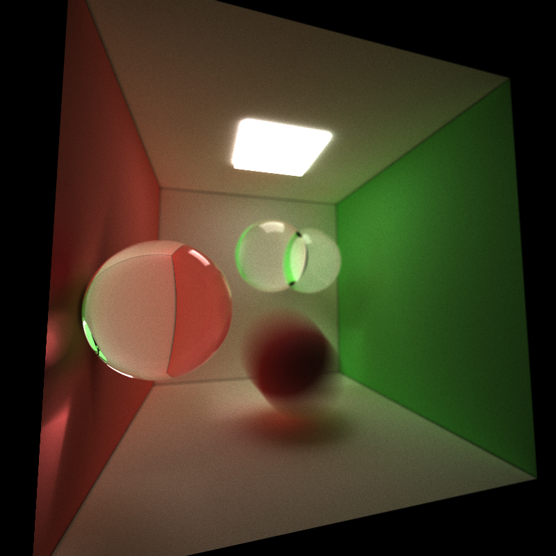
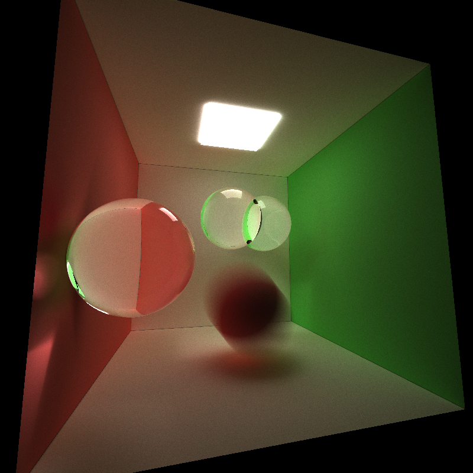
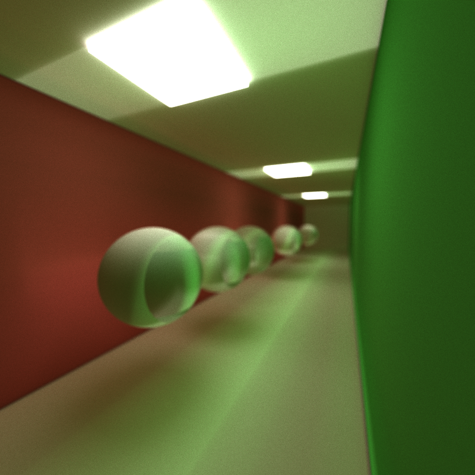
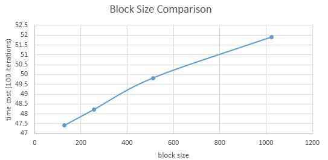
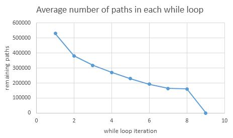

CUDA Path Tracer
================

* Kaixiang Miao
* Tested on: Windows 7, i7-3630QM @ 2.40GHz 8GB, GTX 660M 2GB (Lenovo Y580 laptop, personal computer)

## Screenshot

Final image:

No direct lighting:

No depth of field:

Testing depth of field:

## Features

* **Ideal diffuse surface && perfectly specular-reflective**

Setting `pathSegment.ray.origin` to intersection point (adding an offset on the direction of the reflected ray) and calculating the reflected direction.

* **Stream compaction**

Using `thrust::remove_if` and `thrust::count_if`:

	void compressedPathandIntersection(int& num_paths, PathSegment *paths, bool *flag)
	{
		thrust::device_ptr<bool> dev_ptrFlag(flag);
		thrust::device_ptr<PathSegment> dev_ptrPaths(paths);
		thrust::remove_if(dev_ptrPaths, dev_ptrPaths + num_paths, dev_ptrFlag, thrust::logical_not<bool>());
		num_paths = thrust::count_if(dev_ptrFlag, dev_ptrFlag + num_paths, thrust::identity<bool>());
	}

* **Sorted rays by material index**

Using `thrust::tuple` and `thrust::zip_iterator`:
 
	typedef thrust::tuple<PathSegment, ShadeableIntersection> Tuple;
	class cmp
	{
	public:
		__host__ __device__ bool operator()(const Tuple &a, const Tuple &b)
		{
			return a.get<1>().materialId < b.get<1>().materialId;
		}
	};
	
	void SortByMaterial(int num_paths, PathSegment *dev_paths, ShadeableIntersection *dev_intersections)
	{
		thrust::device_ptr<PathSegment> ptrPath(dev_paths);
		thrust::device_ptr<ShadeableIntersection> ptrIntersection(dev_intersections);
		
		typedef thrust::tuple<thrust::device_ptr<PathSegment>, thrust::device_ptr<ShadeableIntersection>> IteratorTuple;
		typedef thrust::zip_iterator<IteratorTuple> ZipIterator;
		ZipIterator zip_begin = thrust::make_zip_iterator(thrust::make_tuple(ptrPath, ptrIntersection));
		ZipIterator zip_end = zip_begin + num_paths;
		thrust::sort(zip_begin, zip_end, cmp());
	}

* **Caching the first bounce intersections**

		if (iter == 1)
		{
			generateRayFromCamera <<<blocksPerGrid2d, blockSize2d >>>(cam, iter, traceDepth, dev_paths);
			checkCUDAError("generate camera ray");
			 tracing
			cudaMemset(dev_intersections, 0, pixelcount * sizeof(ShadeableIntersection));
			dim3 numblocksPathSegmentTracing = (num_paths + blockSize1d - 1) / blockSize1d;
			computeIntersections <<<numblocksPathSegmentTracing, blockSize1d>>> (
				depth
				, num_paths
				, dev_paths
				, dev_geoms
				, hst_scene->geoms.size()
				, dev_intersections
				, dev_lightIndex
				, lightCounter
				);
			checkCUDAError("trace one bounce");
			cudaMemcpy(dev_cachePaths, dev_paths, num_paths * sizeof(PathSegment), cudaMemcpyDeviceToDevice);
			cudaMemcpy(dev_cacheIntersections, dev_intersections, num_paths * sizeof(ShadeableIntersection), cudaMemcpyDeviceToDevice);
		}

* **Frensel effect**

Using Schlick's approximation and russian roulette to combine refraction and reflection.

	thrust::uniform_real_distribution<float> u01(0, 1);
	if (u01(rng) < (n2 - n1) / (n2 + n1) * (n2 - n1) / (n2 + n1) + (1 - (n2 - n1) / (n2 + n1) * (n2 - n1) / (n2 + n1)) * pow(1 - cosTheta, 5))
	{
		pathSegment.ray.direction = -2 * glm::dot(pathSegment.ray.direction, realNormal) * realNormal + pathSegment.ray.direction;
	}
	else
	{
		pathSegment.ray.direction = glm::refract(pathSegment.ray.direction, realNormal, eta);
	}

* **Depth of field**

Jittering the rays based on a focal plane:

	if (depthOfField)
	{
		// depth of field
		cam.focalDistance = 4.0f;

		glm::vec3 pointOnFocalPlane = segment.ray.origin + cam.focalDistance * segment.ray.direction;
		glm::vec3 pointOnScreen = segment.ray.origin + segment.ray.direction;
		thrust::default_random_engine rngx = makeSeededRandomEngine(iter, x, 0);
		thrust::default_random_engine rngy = makeSeededRandomEngine(iter, y, 0);
		
		float jitterx = (u01(rngx) - 0.5) * 2 / 40.0f;
		float jittery = (u01(rngy) - 0.5) * 2 / 40.0f;
		pointOnScreen += cam.right * jitterx + cam.up * jittery;

		segment.ray.origin = pointOnScreen;
		segment.ray.direction = pointOnFocalPlane - pointOnScreen;
	}

* **Direct lighting**

Sending a ray at the last bounce:

	// direct lighting
	if (pathSegment.remainingBounces == 1)
	{
		for (int i = 0; i < lightSize; i++)
		{
			Geom & geomLight = geoms[lightIndex[i]];
			
			...
		}
	}

* **Motion blur**

Defining time for each ray and interpolating the position based on the time:

	// update position of the geometry based on ray's time
	glm::vec3 interpolatedPos = (1 - pathSegment.dTime) * geom.translationStart + pathSegment.dTime * geom.translationEnd;
	geom.transform = cudaBuildTransformationMatrix(interpolatedPos, geom.rotation, geom.scale);
	geom.inverseTransform = glm::inverse(geom.transform);
	geom.invTranspose = glm::inverseTranspose(geom.transform);

## Performance Analysis

* **Block size comparison**

It seems that `blockSize = 128` works well on my machine.

* **Stream compaction helps most after a few bounces. Print and plot the effects of stream compaction within a single iteration (i.e. the number of unterminated rays after each bounce) and evaluate the benefits you get from stream compaction.**

Using stream compaction, the number of paths decrease after each bounce.

* **Compare scenes which are open (like the given cornell box) and closed (i.e. no light can escape the scene). Again, compare the performance effects of stream compaction! Remember, stream compaction only affects rays which terminate, so what might you expect?**

If the scene is open, rays may be terminated earlier than the closed scene because rays are likely to hit no object. In a closed scene, rays will bounce again and again until it reaches the maximum bounce times. Thus, stream compaction works efficiently in the open scene since lots of terminated rays can be removed after each bounce while it's wasteful in a closed scene since all the rays terminate in the last bounce (last while loop) and there's no need to do stream compaction after each bounce.

