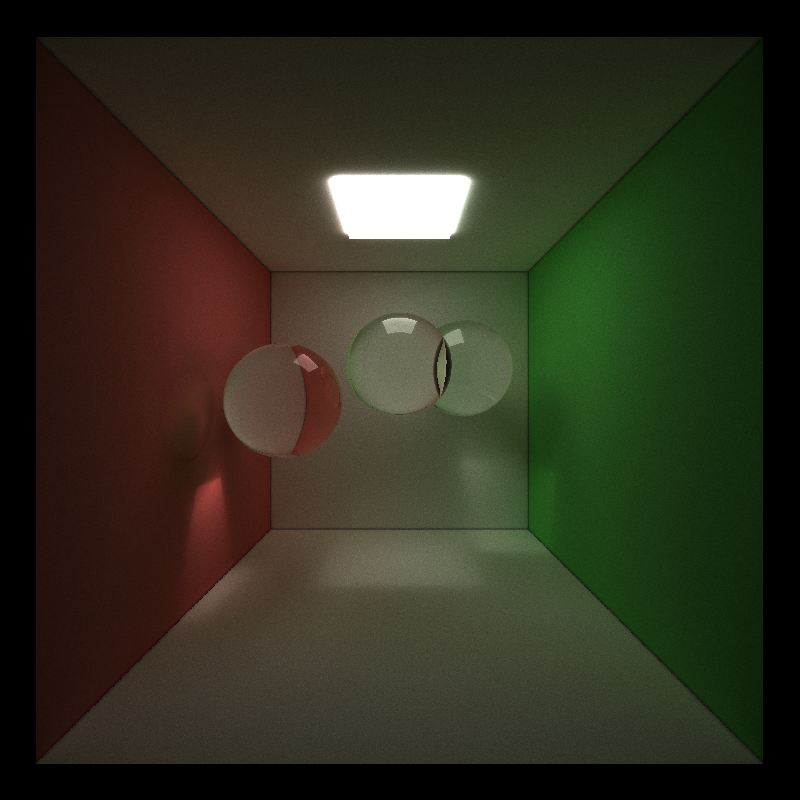

CUDA Path Tracer
================

* Kaixiang Miao
* Tested on: Windows 7, i7-3630QM @ 2.40GHz 8GB, GTX 660M 2GB (Lenovo Y580 laptop, personal computer)

## Screenshot

Final image:

No direct lighting:

No depth of field:

Testing depth of field:

## Features

* **Ideal diffuse surface && perfectly specular-reflective**
* **Stream compaction using thrust::remove_if**

	void compressedPathandIntersection(int& num_paths, PathSegment *paths, bool *flag)
	{
		thrust::device_ptr<bool> dev_ptrFlag(flag);
		thrust::device_ptr<PathSegment> dev_ptrPaths(paths);
		thrust::remove_if(dev_ptrPaths, dev_ptrPaths + num_paths, dev_ptrFlag, thrust::logical_not<bool>());
		num_paths = thrust::count_if(dev_ptrFlag, dev_ptrFlag + num_paths, thrust::identity<bool>());
	}

* **Sorted rays by material index**
* **Caching the first bounce intersections**
* **Frensel effect**
* **Depth of field**
* **Direct lighting**
* **Motion blur**

